# jPipe Runner

```text
     _ ____  _               ____                              
   (_)  _ \(_)_ __   ___   |  _ \ _   _ _ __  _ __   ___ _ __ 
   | | |_) | | '_ \ / _ \  | |_) | | | | '_ \| '_ \ / _ \ '__|
   | |  __/| | |_) |  __/  |  _ <| |_| | | | | | | |  __/ |   
  _/ |_|   |_| .__/ \___|  |_| \_\\__,_|_| |_|_| |_|\___|_|   
 |__/        |_|                                              
```

A Justification Runner designed for jPipe.

## 📦Features

* **CLI Interface**: Executes the runner on a `.jd.json` file.
* **GraphWorkflowVisualizer** GUI debugger based on Tkinter to interactively display execution steps.
* **GitHub Action** for automated CI/CD integration and TODO.
* **Extensible Framework** with decorators, validators, and context management.
* **Cross-platform Packaging**: Distributed via PyPI, Debian PPA, and Homebrew formula.

---

## 📏Architecture Overview

The project adopts a modular directory structure:

```text
jpipe-runner/
├── bin/                      # CLI entrypoint script
├── mermaid/                  # Pre-generated architecture diagram (SVG)
├── script/                   # Packaging scripts (PPA, Brew, etc.)
├── src/jpipe_runner/         # Core library implementation
│   ├── framework/            # Engine, context, decorators, validators
├── tests/unit/               # Unit tests
├── Dockerfile                # Container definition
├── action.yml                # GitHub Action metadata
├── .github/workflows/        # CI & release pipeline (release.yml)
├── pyproject.toml            # Poetry configuration
├── poetry.lock               # Locked dependencies
├── pytest.ini                # pytest configuration
├── LICENSE                   # MIT License
```

<details>
<summary>Architecture diagram</summary>



</details>

---

## ⚙️Installation

### Prerequisites

* Python 3.10+
* [Poetry](https://python-poetry.org)
* [Graphviz](https://graphviz.org/) (`libgraphviz-dev`, `pkg-config`)
* [Tkinter](https://docs.python.org/3/library/tkinter.html)

### From Source

```bash
# Lock and install dependencies
poetry lock
poetry install
```

### Alternative: requirements.txt

If you need a `requirements.txt` for pip environments:

```bash
poetry export -f requirements.txt --without-hashes -o requirements.txt
```

### Build Package

```bash
# Run tests
poetry run pytest

# Build distributable
poetry build
```

---

## 🚀 Usage

### CLI

```bash
poetry run jpipe-runner [-h] [--variable NAME:VALUE] [--library LIB] \
                         [--diagram PATTERN] [--output FILE] [--dry-run] \
                         [--verbose] [--config-file PATH] [--gui] jd_file
```

**Key options:**

* `--variable`, `-v`: Define `NAME:VALUE` pairs for template variables.
* `--library`, `-l`: Load additional Python modules.
* `--diagram`, `-d`: Select diagrams by wildcard pattern.
* `--output`, `-o`: Specify output image file (format inferred by extension).
* `--dry-run`: Validate workflow without executing.
* `--verbose`, `-V`: Enable debug logging.
* `--config-file`: Load workflow config from a YAML file.
* `--gui`: Launch the Tkinter-based `GraphWorkflowVisualizer`

Example:

```bash
poetry run jpipe-runner --variable X:10 --diagram "flow*" \
                         --output diagram.png workflow.jd
```

---

## 🤖 GitHub Action

The `action.yml` defines a composite Action to install and run the runner in CI:

```yaml
uses: jpipe-mcscert/jpipe-runner@main
with:
  jd_file: path/to/workflow.jd
  variable: |
    FOO:bar
    BAZ:42
  library: requests
  diagram: "*
  dry_run: false
```

Generates diagrams and comments a PNG to issues/prs.

---

## 📋 CI & Release

Automated via `.github/workflows/release.yml`:

1. **Validate version tag** matches `pyproject.toml`.
2. **Unit tests** on Python 3.10.
3. **Build** Python package, Debian PPA, and Homebrew formula.
4. **Publish** to GitHub Releases, PyPI, Launchpad PPA, and Homebrew tap.

---

## 📝 Developer Documentation

To generate internal developer-facing documentation using **Sphinx**, follow the instructions in [`docs/BUILD_DOCS.md`](docs/BUILD_DOCS.md).

This includes:

* Setting up the Sphinx environment
* Building HTML documentation
* Auto-generating API references from source files

---

## 🔧 Contributing

1. Fork the repo and create a feature branch.
2. Ensure all new features include unit tests (`tests/unit`).
3. Run `pytest` and `poetry build` before submitting a PR.
4. Adhere to PEP8 and project linting rules.

Please read [CODE\_OF\_CONDUCT.md](.github/CODE_OF_CONDUCT.md) for community guidelines.

---

## 📄 License

MIT License — see [LICENSE](LICENSE).

---

## 👤 Authors

* [Jason Lyu](https://github.com/xjasonlyu)
* [Baptiste Lacroix](https://github.com/BaptisteLacroix)
* [Sébastien Mosser](https://github.com/mosser)

## How to cite?

```bibtex
@software{mcscert:jpipe-runner,
  author = {Mosser, Sébastien and Lyu, Jason and Lacroix, Baptiste},
  license = {MIT},
  title = {{jPipe Runner}},
  url = {https://github.com/ace-design/jpipe-runner}
}
```

## How to contribute?

Found a bug, or want to add a cool feature? Feel free to fork this repository and send a pull request.

If you're interested in contributing to the research effort related to jPipe projects, feel free to contact the PI:

- [Dr. Sébastien Mosser](mailto:mossers@mcmaster.ca)
