# 📦 Packaging & Release Guide

This guide explains how to build, release, and distribute `jpipe-runner` using **Poetry**, **GitHub Actions**, **Launchpad PPA**, **Pypi**/**TestPyPI**, and **Homebrew**.

---

## 🚀 Release Pipeline Overview

The CI/CD pipeline automates testing, packaging, and publishing to multiple platforms. It is defined in `.github/workflows/release.yml` and triggered on GitHub tags.

### 🔁 Pipeline Steps

1. **Version Check**

   * Verifies the pushed Git tag matches the version declared in `pyproject.toml`.

2. **Run Tests**

   * Executes unit tests with `pytest` on Python 3.10 using Poetry-managed environment.

3. **Build Artifacts**

   * Python source distribution (`.tar.gz`) and wheel (`.whl`) via Poetry.
   * Debian source packages via `build-ppa`.
   * Homebrew formula file via `generate-formula.sh`.

4. **Sign & Upload to Launchpad (PPA)**

   * Source packages signed with GPG and uploaded using `opublish-ppa` script.

5. **Publish**

   * GitHub Release: attaches built assets.
   * Test PyPI: for preview distribution.
   * Homebrew Tap: generates Ruby formula for macOS installs.

6. **Post-validation**

   * Verifies version and checks if `jpipe-runner --help` executes without error.


### Pipeline Workflow

<details>
<summary>Workflow diagram</summary>



</details>


---

## 🧰 Poetry Workflow

### Exporting Requirements

```bash
poetry export -f requirements.txt --without-hashes -o requirements.txt
```

### Building Package

```bash
poetry build
```

---

## 🔐 GPG for Launchpad PPA

### Step-by-step

1. **Generate GPG key:**

```bash
gpg --full-generate-key
```

2. **Find your key ID:**

```bash
gpg --list-keys --keyid-format LONG
```

3. **Upload to Ubuntu Keyserver:**

```bash
gpg --keyserver hkp://keyserver.ubuntu.com:80 --send-keys <KEY_ID>
```

4. **Verify Key is Published:**
   [https://keyserver.ubuntu.com/pks/lookup?search=\<KEY\_ID>\&fingerprint=on\&op=index](https://keyserver.ubuntu.com/pks/lookup)

5. **Add to Launchpad:**
   [https://launchpad.net/~<username\>/+editpgpkeys](https://launchpad.net/~<username>/+editpgpkeys)

6. **Decrypt Launchpad Email Message:**
   Paste the PGP message into a file:

```bash
nano launchpad.asc
gpg --decrypt launchpad.asc
```

Click the link from the decrypted message to confirm.

---

## 🏗️ Build Debian Package (PPA)

Run the script:

```bash
./script/build-ppa.sh "Your Name" dev@example.com <GPG_ID>
```

This builds and signs `.changes` files per supported Ubuntu distro (e.g., jammy, noble).

Then upload with:

```bash
./script/publish-ppa.sh mcscert/ppa deb_dist/*.changes
```

---

## 🍺 Homebrew Formula

Run the formula generator:

```bash
./script/generate-formula.sh
```

The resulting files:

* `tap/Formula/jpipe-runner.rb`
* `tap/Formula/jpipe-runner@2.0.0b8.rb`

Use them for installation:

```bash
brew install --formula ./tap/Formula/jpipe-runner.rb
brew uninstall jpipe-runner
```

---

## 🧪 Install jpipe-runner (all methods)

### Ubuntu / Debian

```bash
sudo add-apt-repository ppa:mcscert/ppa
sudo apt update
sudo apt install jpipe-runner
```

### PyPI

For testing (test PyPI):
```bash
pip install -i https://test.pypi.org/simple/ jpipe-runner
```
For production:
```bash
pip install jpipe-runner
```

### Homebrew

```bash
brew install --formula ./tap/Formula/jpipe-runner.rb
```

---

## 🧼 Cleanup

Before building again:

```bash
rm -rf dist/ deb_dist/ *.tar.gz
```

Ensure dependencies:

```bash
sudo apt install dh-python python3-all python3-setuptools
pip install stdeb wheel
```

---

## 🛡️ Security & Signing

* All Debian packages are signed using your GPG key.
* Homebrew installs run a sanity check post-install (`--help`).

---

For support or help: **[Dr. Sébastien Mosser](mailto:mossers@mcmaster.ca)**
