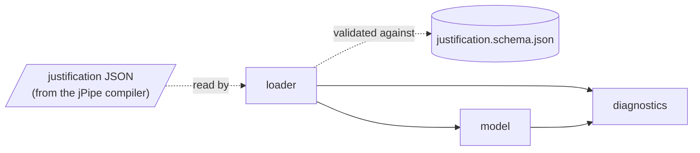
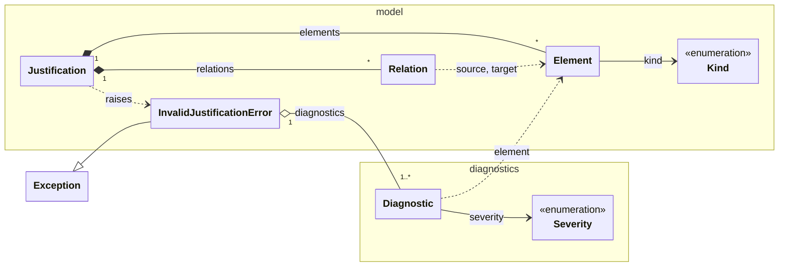

# Design

How jpipe-runner v4 is built, for contributors. This page describes the code as it is, not
the plan: update it in the commit that changes the design.

## Modules

A solid arrow is an import: the module at its tail uses the module at its head. A dotted
arrow is data.

| Module | Role |
|--------|------|
| [`loader`](../src/jpipe_runner/loader.py) | Reads the JSON the jPipe compiler emits, checks it against the schema, and builds a `Justification`. Entry points: `load(path)` and `loads(text)`. |
| [`model`](../src/jpipe_runner/model.py) | The justification model: elements, the relations between them, and the graph they form. |
| [`diagnostics`](../src/jpipe_runner/diagnostics.py) | `Diagnostic`, what the runner reports about a model, a step library or a run. |

## Classes

A `Justification` is a model loaded from the compiler: a name, its elements and its
relations. Each `Element` has a `Kind` (evidence, strategy, sub-conclusion, conclusion). A
`Relation` goes from the supporting element to the element it supports, so evidence are
the sources of the graph and the conclusion is its sink.

**Elements are designated by id.** A `Relation` holds the ids of its two ends, and a
`Diagnostic` the id of the element it is about, not the `Element` objects; the dotted
arrows above are these references. An element also answers to its aliases, the ids of the
elements that composition merged into it, which binding resolution uses.

**The graph is NetworkX.** `Justification.graph` is a `DiGraph` whose nodes are element
ids, each carrying its `Element`, and whose edges are the relations.

**A model is immutable.** `Element`, `Relation` and `Diagnostic` are frozen dataclasses,
and the graph is frozen once built.

**A `Justification` is valid by construction.** A model that cannot be run is never
loaded. The loader rejects a document that is not JSON or does not match the schema
(`JP001`), and the `Justification` constructor rejects a duplicate element id (`JP002`) or
a relation to an element that does not exist (`JP003`). Either raises an
`InvalidJustificationError` carrying every problem found, as diagnostics.

**A diagnostic's `code` is its contract.** The `message` is written for humans and may be
reworded. A `Severity.ERROR` stops the run; a `WARNING` is reported and the run continues.
