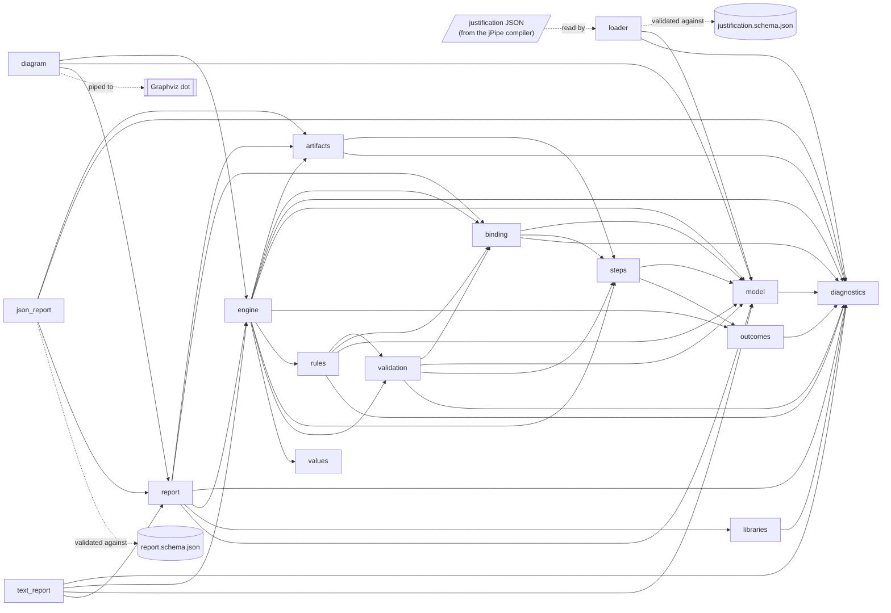
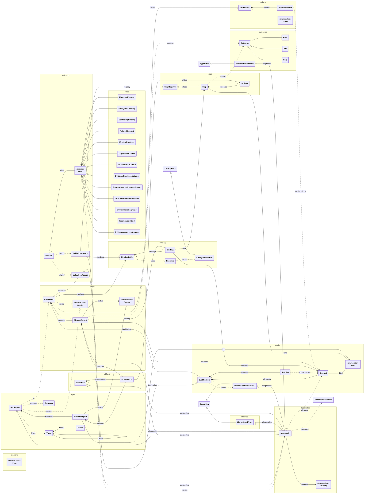

# Design

How jpipe-runner v4 is built, for contributors. This page describes the code as it is, not
the plan: update it in the commit that changes the design.

## Modules

A solid arrow is an import: the module at its tail uses the module at its head. A dotted
arrow is data.

| Module | Role |
|--------|------|
| [`loader`](../src/jpipe_runner/loader.py) | Reads the JSON the jPipe compiler emits, checks it against the schema, and builds a `Justification`. Entry points: `load(path)` and `loads(text)`. |
| [`model`](../src/jpipe_runner/model.py) | The justification model: elements, the relations between them, and the graph they form. |
| [`steps`](../src/jpipe_runner/steps.py) | The decorators that declare a step library's functions, `@evidence`, `@strategy`, `@sub_conclusion` and `@conclusion`, and the `StepRegistry` that collects them from the library's modules. |
| [`binding`](../src/jpipe_runner/binding.py) | Resolves the ids a step names to elements of the model, and binds steps to elements, one to one, in a `BindingTable`. |
| [`validation`](../src/jpipe_runner/validation.py) | Checks a step library against its model before anything runs: `Rule`, one check; `RuleSet`, which runs rules over a `ValidationContext` and collects what they report in a `ValidationReport`. |
| [`rules`](../src/jpipe_runner/rules.py) | Every validation rule, one class each, and `RULES`, the rule set every run uses. [`rules.md`](rules.md) is generated from it. |
| [`engine`](../src/jpipe_runner/engine.py) | Runs a step library against its model: validates it, then calls the steps supporters first, and returns a `RunResult`, each element's `ElementResult` and the verdict. Entry point: `run(justification, registry)`. |
| [`libraries`](../src/jpipe_runner/libraries.py) | Imports a run's step libraries, each as a module named after its file, with the run's python path, and forgets them after the run. Entry point: `imported(libraries, python_path)`. |
| [`artifacts`](../src/jpipe_runner/artifacts.py) | Observes the artifacts of an evidence just before its step is called: whether each can be reached, what it was (path, SHA-256, size), and what the step receives. |
| [`report`](../src/jpipe_runner/report.py) | The `RunReport` of a run, built for every way a run ends, even when nothing ran: each element of the model with its status, its step and what that step declares, observed and produced, then every diagnostic. Entry points: `RunReport.of(result)`, `RunReport.refused(error)`, `RunReport.not_imported(justification, error)`. |
| [`json_report`](../src/jpipe_runner/json_report.py) | Renders a `RunReport` as the JSON report, the machine-readable contract described by `report.schema.json` and [`report-schema.md`](report-schema.md). Entry points: `document(report)`, `dumps(report)`. |
| [`diagram`](../src/jpipe_runner/diagram.py) | Draws a justification as the jPipe compiler draws it, with a run's statuses over it, and in the dataflow view the files and variables its steps declare. Entry points: `source(justification, report)`, `write(path, justification, report)`. |
| [`text_report`](../src/jpipe_runner/text_report.py) | Renders a `RunReport` as text for a terminal, in the manner of Cucumber. Entry point: `render(report)`. |
| [`values`](../src/jpipe_runner/values.py) | The `ValueStore` of a run: the values its steps produced, each with the element that produced it. |
| [`outcomes`](../src/jpipe_runner/outcomes.py) | What a step returns: `Pass`, carrying the values it produces, `Fail` or `Skip`. |
| [`diagnostics`](../src/jpipe_runner/diagnostics.py) | `Diagnostic`, what the runner reports about a model, a step library or a run, and `user_traceback`, an exception's traceback without the runner's frames. |
| [`framework`](../src/jpipe_runner/framework/__init__.py) | Not a module of v4: the v3 authoring API lived under this name, and importing it raises an `ImportError` that says what replaced it. |

The public API, what a step library imports, is the package itself: `from jpipe_runner
import evidence, strategy, sub_conclusion, conclusion, Outcome, Pass, Fail, Skip`.
What runs a justification, the command line from M6, uses three entry points:
`loader.load(path)`, `libraries.imported(libraries, python_path)`, inside which
`engine.run(justification, registry)` runs. Whichever way the run ends, it builds a
`RunReport`, and renders it.

## Classes

A `Justification` is a model loaded from the compiler: a name, its elements and its
relations. Each `Element` has a `Kind` (evidence, strategy, sub-conclusion, conclusion). A
`Relation` goes from the supporting element to the element it supports, so evidence are
the sources of the graph and the conclusion is its sink.

**Elements are designated by id.** A `Relation` holds the ids of its two ends, and a
`Diagnostic` the id of the element it is about, not the `Element` objects; the dotted
arrows above are these references. An element also answers to its aliases, the ids of the
elements that composition merged into it, which binding resolution uses.

**The graph is hidden inside `Justification`.** It is a NetworkX `DiGraph`, but no
NetworkX type appears in the public API, and only `model` imports NetworkX. Callers ask the
model instead: `supporters(id)`, `supported(id)`, `upstream(id)` (every element that
supports it, directly or not) and `topological_order()`. Their results are deterministic,
ordered by model order, the order in which the model lists its elements: supporters,
supported and upstream elements are sorted by it, and the topological order breaks ties by
it.

**A model is immutable.** `Element`, `Relation` and `Diagnostic` are frozen dataclasses,
and the graph is frozen once built.

**A `Justification` is valid by construction.** A model that cannot be run is never
loaded. The loader rejects a document that is not JSON or does not match the schema
(`JP001`), and the `Justification` constructor rejects a duplicate element id (`JP002`) or
a relation to an element that does not exist (`JP003`). An alias counts as an id: one that
another element also answers to is `JP002` too. Each of these raises an
`InvalidJustificationError` carrying every problem found, as diagnostics. So does a cycle
in the relations (`JP004`), reported once the rest is sound: the compiler never emits one,
and the steps of a cyclic argument would have no order to run in.

**A diagnostic's `code` is its contract.** The `message` is written for humans and may be
reworded. A `Severity.ERROR` found while loading or validating stops the run before any
step executes; one found while the steps run fails the element it is about, and the run
goes on. A `WARNING` is reported and changes nothing else.

**A step library is validated against its model before anything runs.** Each check is a
`Rule`, reified as a class: its `code`, `severity` and `summary` are class attributes, and
its docstring says what it checks, why, and how to fix what it reports, so that every rule
can be audited in one place. A `ValidationContext` holds what the rules read: the model,
the step registry, and the `BindingTable` of one to the other, with the bound steps that
produce and consume each variable. A step that binds nothing never runs, so the rules about
data look only at bound steps. A `RuleSet` runs every rule, in code order, and collects
every diagnostic in a `ValidationReport`, which passes when none is an error. A strict run
reports warnings as errors. No rule can be disabled. What the model alone shows to be
unrunnable (`JP001` to `JP004`) is not a rule: the loader refuses it first.

**Every rule is in one module, `rules`, and the reference is generated from it.** Each
rule is a subclass of `Rule`. The rules about binding (`JP006`, `JP007`, `JP015`) report
what the `BindingTable` found, under their own code. The rules about data ask the model
which elements support which: a variable's producer must support its consumer, directly
or not (`upstream`), because a step runs only once its supporters have passed. A step's
kind is compared with its element's: an evidence or a conclusion turned into a
sub-conclusion is what composition does, and is a warning (`JP008`); any other difference
is an error (`JP016`). [`rules.md`](rules.md), the reference
of every diagnostic code, is rendered from the rules' classes, and a test fails when the
committed page differs.

**A step library declares its functions with one decorator per kind.** `@evidence`,
`@strategy`, `@sub_conclusion` and `@conclusion` take the ids of the elements a function
implements, as positional arguments, and the variables it `consumes` and `produces`. Each
kind's decorator accepts only what the kind can do: evidence consumes nothing, and a
conclusion produces nothing. Only evidence `observes` artifacts: a mapping from parameter
name to a path relative to the run's working directory, kept on the `Step` as `Artifact`s.
A path names a file or a glob of files, never a directory. A decorator attaches a `Step`
to the function and returns the function unchanged, so a step is still a plain function.
A declaration that is wrong on its face is a `TypeError` when the library is imported: no
id, a variable or parameter name that is not a Python identifier, an absolute path or a
directory, or a parameter list that is not exactly the consumed variables, or for
evidence the observed artifacts (a parameter with a default, or `**kwargs`, is allowed).

**A step is bound to an element through the ids it names.** An id designates an element
if it is the element's id or one of its aliases, then if it is that prefixed with the
justification's name, then if it is a strictly shorter tail of one of those, cut at `:`.
An exact match always wins, and a tail of two elements' ids is ambiguous rather than
resolved to either. This is the rule the jPipe compiler uses to shorten the ids it writes
into a step library, so whatever it writes resolves. A `BindingTable` binds a registry's
steps to a model's elements one to one, and reports, without stopping, every id that
designates no element (`JP015`) or several (`JP006`), every element claimed by several
steps, and every step whose ids designate several elements (`JP007`). The elements of a
conflict are left unbound, and listed as `contested`, so that validation does not report
them again as unbound.

**Declaration and execution are kept apart, and neither is global.** What a step library
declares is a `StepRegistry`; what a run produces is a `ValueStore`. Both are built for a
run and dropped with it, and no module holds one, so two runs in one process share
nothing. `StepRegistry.from_modules` scans the namespaces of a library's modules for
steps, each listed once, in order, so a module that Python has cached is collected again
as it is. A `ValueStore` maps each variable to its `ProducedValue`: what was produced, and the id
of the element whose step produced it. A variable is produced once, and one that nothing
has produced reads as `UNSET`, which is not `None`: `None` is a value a step can produce.

**A step reports its result by returning an `Outcome`.** `Pass` carries the values the
step produces, by variable name; `Fail` carries the reason the check does not hold; `Skip`
the reason the step declines to judge. Outcomes are frozen, and so are the values of a
`Pass`. A step that returns anything else, such as the `bool` a v3 step returned, is
reported with `JP017` by `as_outcome`, and the diagnostic's `fix` names the outcome to
return instead.

**An evidence's artifacts are observed just before its step is called.** `observe` takes
the step's `Artifact`s and the run's root, and returns what was `Observed`: an
`Observation` of each file, with its path relative to the root, its SHA-256 and its size,
the arguments the step receives (a `Path`, or for a glob the sorted `list[Path]` it
matches), and a `JP019` diagnostic for each artifact that cannot be reached. A missing or
unreadable file, a directory or anything else that is not a regular file (a pipe, a
device, which could block the run), and a glob that matches nothing are unreachable, and
are recorded without a digest. Each file is read once, to hash it and measure it, so the
record is the state the step is about to see.

**A run's step libraries are imported for the run, and forgotten after it.** `imported`
is a context manager, and the steps run inside it. Each library is a module named after
its file (`steps.py` is `steps`, so that reports name a step `steps.function`),
registered in `sys.modules` before it runs, as an import would. A library whose file name
cannot be its module's name is refused before anything is imported (`JP021`): two
libraries with one name, a name another module already has, or a name that is not an
identifier. Every library is then imported, and each one that raises is reported
(`JP020`) at the line where it failed, with its traceback, which `user_traceback` trims
to the library's own frames. The `python_path` entries are first on `sys.path` while the
context lasts, so that a step importing a helper when it runs finds it, and on exit
`sys.path` is restored to what it was, even after an exception or a step that changed
it. The libraries leave `sys.modules` on exit, with the modules imported from the
`python_path` entries; third-party modules stay cached, since a C extension cannot be
imported twice in a process.

**A run validates, then calls the steps supporters first.** `run` builds the
`ValidationContext`, runs `RULES`, and executes only if no error was reported; otherwise
its `RunResult` has no element results and the verdict `INVALID`. Elements are taken in
`topological_order()`. An element a supporter of which did not pass is skipped, and its
`blocked_by` names the root causes: the elements upstream that failed, or were skipped,
on their own account, since every element in between was stopped by them. A failure and
a skip propagate alike, because what a step that did not pass would have produced does not
exist. An element whose supporters all passed has its step called, whatever its kind, so
a cross-check (`JP008`) runs after the argument below it; an unbound claim passes, and
one that nothing supports is skipped. A step is called with the values it consumes, read
from the run's `ValueStore`, and the artifacts it observes, observed just before the call.
Validation makes an unset input impossible: a consumed variable has one producer, which
supports its consumer (`JP009`, `JP014`), and a `Pass` stores every value its step
declares or fails (`JP023`). The engine raises a `RuntimeError` rather than pass `UNSET`.

**What a step does wrong fails its element, and the run goes on.** An exception (`JP022`,
whose diagnostic carries the traceback, trimmed by `user_traceback`), a value that is not an outcome
(`JP017`), an unreachable artifact (`JP019`, and the step is not called) and a missing
declared value (`JP023`) fail the element, with the diagnostic on its `ElementResult`. An
undeclared value is dropped, with a warning (`JP024`): no step can consume it, so it
changes nothing. What a step produced is recorded on its `ElementResult` as a deep copy,
taken when it returned, so that a step that changes a value it consumes does not change
the record. `KeyboardInterrupt` stops the run. The verdict is `FAIL` if an element
failed, else `SKIP` if one was skipped, else `PASS`. The engine prints nothing: it logs
to the `jpipe_runner.engine` logger, and the report is built from the `RunResult`.

**Every way a run ends has a report, and renderers are pure functions of it** (the diagram,
of it and its model). A
`RunReport` is built from a `RunResult`, or, when nothing could run, from the
`InvalidJustificationError` of a refused model or the `LibraryLoadError` of libraries that
could not be imported. It is plain data: every element of the model, in topological order,
with its status (`None` when nothing ran), the step bound to it, what that step declares
(the artifacts it observes, the variables it consumes and produces), and what the run
observed and produced; then every diagnostic, in the order found, and a `Summary` of both.
A diagnostic about an exception (`JP020`, `JP022`) carries its traceback, which the report
shows as a `Trace`: its frames' files relative to the run's root, and the same on every
Python version. The text renderer, `text_report.render`, lays a report out for a person, in
the manner of Cucumber: each element with a symbol for its status, its kind, its label and
its id, why it did not pass, then the diagnostics, the summary and the verdict. Its layout
is not a contract. Whether to colour it is the caller's decision (`use_colour`: a terminal,
unless `NO_COLOR` is set).

**The JSON report is the contract** ([ADR-0011](adr/0011-json-report-is-the-machine-readable-contract.md)).
`json_report.document` writes a report as the JSON document that `report.schema.json`,
shipped in the package, describes, versioned by `schema_version`. It is deterministic: no
time, relative paths, fields in a fixed order. A produced value is written as itself when
it is JSON, and as its `repr` and type otherwise, a `repr` made canonical: paths under the
root relative to it, sets sorted, no object addresses. [`report-schema.md`](report-schema.md)
documents it for readers.

**A diagram is the compiler's drawing, with the run over it**
([ADR-0022](adr/0022-diagrams-follow-the-compiler.md)). `diagram.source` writes the DOT
text of a justification as the compiler's `DotExporter` does (jPipe 2.5.0): its quoted ids,
its labels wrapped at 40 characters, its shapes and Okabe-Ito colours, nodes in model order
and edges in the order of the model's relations. A report's statuses are drawn over it in
the same palette: a green border for a pass, a vermillion fill for a failure, a dashed grey
node for a skip. The dataflow `View` adds, from what the report says the steps declare,
each observed file and each variable as a node. `write` pipes the text to Graphviz's `dot`;
only the `dot` format is written without it. Since the compiler's drawing follows the
model's order, a diagram is drawn from the model and the report together, and a report
whose elements, or what each supports, differ from the model's is refused.
