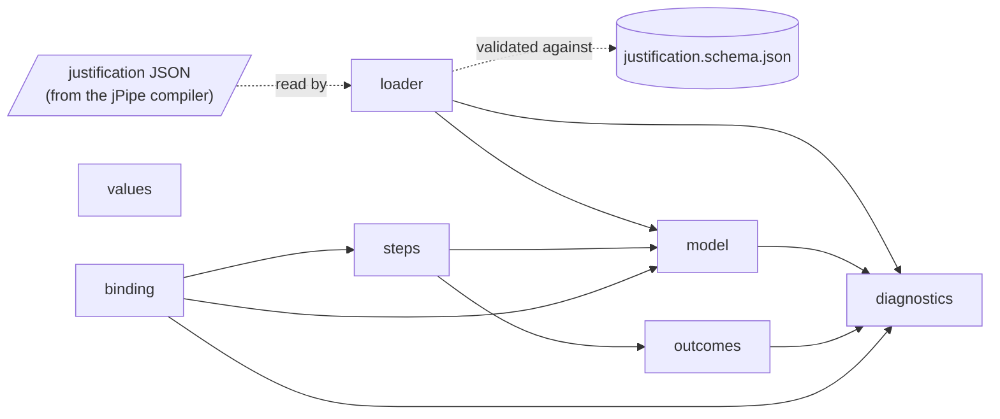
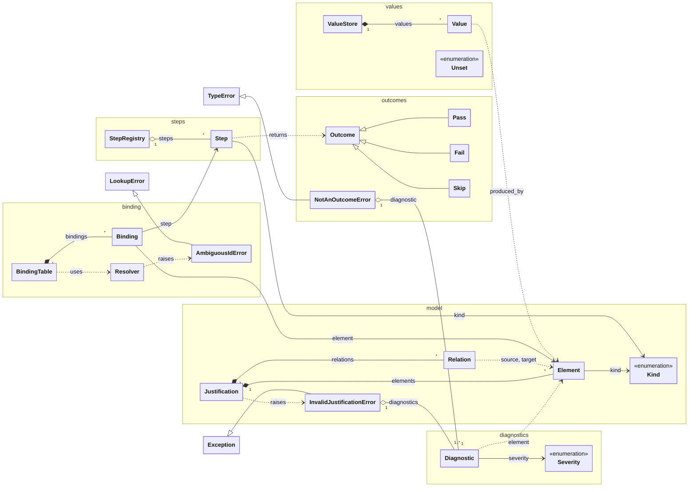

# Design

How jpipe-runner v4 is built, for contributors. This page describes the code as it is, not
the plan: update it in the commit that changes the design.

## Modules

A solid arrow is an import: the module at its tail uses the module at its head. A dotted
arrow is data.

| Module | Role |
|--------|------|
| [`loader`](../src/jpipe_runner/loader.py) | Reads the JSON the jPipe compiler emits, checks it against the schema, and builds a `Justification`. Entry points: `load(path)` and `loads(text)`. |
| [`model`](../src/jpipe_runner/model.py) | The justification model: elements, the relations between them, and the graph they form. |
| [`steps`](../src/jpipe_runner/steps.py) | The decorators that declare a step library's functions, `@evidence`, `@strategy`, `@sub_conclusion` and `@conclusion`, and the `StepRegistry` that collects them from the library's modules. |
| [`binding`](../src/jpipe_runner/binding.py) | Resolves the ids a step names to elements of the model, and binds steps to elements, one to one, in a `BindingTable`. |
| [`values`](../src/jpipe_runner/values.py) | The `ValueStore` of a run: the values its steps produced, each with the element that produced it. |
| [`outcomes`](../src/jpipe_runner/outcomes.py) | What a step returns: `Pass`, carrying the values it produces, `Fail` or `Skip`. |
| [`diagnostics`](../src/jpipe_runner/diagnostics.py) | `Diagnostic`, what the runner reports about a model, a step library or a run. |
| [`framework`](../src/jpipe_runner/framework/__init__.py) | Not a module of v4: the v3 authoring API lived under this name, and importing it raises an `ImportError` that says what replaced it. |

The public API, what a step library imports, is the package itself: `from jpipe_runner
import evidence, strategy, sub_conclusion, conclusion, Outcome, Pass, Fail, Skip`.

## Classes

A `Justification` is a model loaded from the compiler: a name, its elements and its
relations. Each `Element` has a `Kind` (evidence, strategy, sub-conclusion, conclusion). A
`Relation` goes from the supporting element to the element it supports, so evidence are
the sources of the graph and the conclusion is its sink.

**Elements are designated by id.** A `Relation` holds the ids of its two ends, and a
`Diagnostic` the id of the element it is about, not the `Element` objects; the dotted
arrows above are these references. An element also answers to its aliases, the ids of the
elements that composition merged into it, which binding resolution uses.

**The graph is hidden inside `Justification`.** It is a NetworkX `DiGraph`, but no
NetworkX type appears in the public API, and only `model` imports NetworkX. Callers ask the
model instead: `supporters(id)`, `supported(id)`, `topological_order()` and `cycle()`.
Their results are deterministic, ordered by model order, the order in which the model lists
its elements: supporters and supported elements are sorted by it, the topological order
breaks ties by it, and a cycle, listed from supporter to supported, starts from its element
that comes first in it.

**A model is immutable.** `Element`, `Relation` and `Diagnostic` are frozen dataclasses,
and the graph is frozen once built.

**A `Justification` is valid by construction.** A model that cannot be run is never
loaded. The loader rejects a document that is not JSON or does not match the schema
(`JP001`), and the `Justification` constructor rejects a duplicate element id (`JP002`) or
a relation to an element that does not exist (`JP003`). An alias counts as an id: one that
another element also answers to is `JP002` too. Each of these raises an
`InvalidJustificationError` carrying every problem found, as diagnostics.

**A diagnostic's `code` is its contract.** The `message` is written for humans and may be
reworded. A `Severity.ERROR` stops the run; a `WARNING` is reported and the run continues.

**A step library declares its functions with one decorator per kind.** `@evidence`,
`@strategy`, `@sub_conclusion` and `@conclusion` take the ids of the elements a function
implements, as positional arguments, and the variables it `consumes` and `produces`. Each
kind's decorator accepts only what the kind can do: evidence consumes nothing, and a
conclusion produces nothing. A decorator attaches a `Step` to the function and returns the
function unchanged, so a step is still a plain function. A declaration that is wrong on
its face is a `TypeError` when the library is imported: no id, a variable name that is not
a Python identifier, or a parameter list that is not exactly the consumed variables (a
parameter with a default, or `**kwargs`, is allowed).

**A step is bound to an element through the ids it names.** An id designates an element
if it is the element's id or one of its aliases, then if it is that prefixed with the
justification's name, then if it is a strictly shorter tail of one of those, cut at `:`.
An exact match always wins, and a tail of two elements' ids is ambiguous rather than
resolved to either. This is the rule the jPipe compiler uses to shorten the ids it writes
into a step library, so whatever it writes resolves. A `BindingTable` binds a registry's
steps to a model's elements one to one, and reports, without stopping, every id that
designates no element (`JP015`) or several (`JP006`), every element claimed by several
steps, and every step whose ids designate several elements (`JP007`).

**Declaration and execution are kept apart, and neither is global.** What a step library
declares is a `StepRegistry`; what a run produces is a `ValueStore`. Both are built for a
run and dropped with it, and no module holds one, so two runs in one process share
nothing. `StepRegistry.from_modules` scans the namespaces of a library's modules for
steps, each listed once, in order, so a module that Python has cached is collected again
as it is. A `ValueStore` maps each variable to its `Value`: what was produced, and the id
of the element whose step produced it. A variable is produced once, and one that nothing
has produced reads as `UNSET`, which is not `None`: `None` is a value a step can produce.

**A step reports its result by returning an `Outcome`.** `Pass` carries the values the
step produces, by variable name; `Fail` carries the reason the check does not hold; `Skip`
the reason the step declines to judge. Outcomes are frozen, and so are the values of a
`Pass`. A step that returns anything else, such as the `bool` a v3 step returned, is
reported with `JP017` by `as_outcome`, and the diagnostic's `fix` names the outcome to
return instead.
