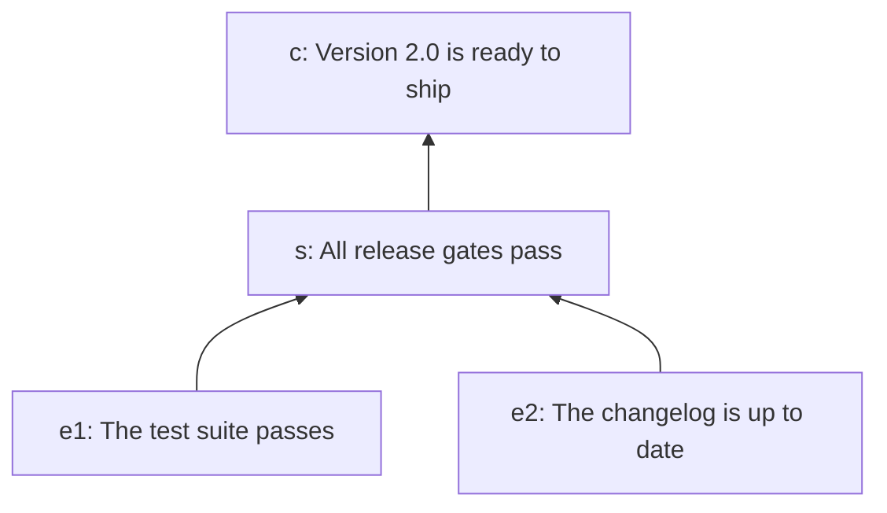

# End to end: the release example

This page follows one example from the argument to its verdict: how a justification
written in jPipe becomes a model the runner reads, how a Python step library is attached
to it, and what the runner does with the two. The test suite runs the same example (and
others) for coverage. This page is meant to be read.

v4 is still being built ([progress](v4-progress.md)). Steps 1 to 4 work
today. Steps 5 to 7 describe what the next milestones build, and are marked as such. This
page grows with each milestone.

The example is the release argument of the [jPipe tutorials](https://www.jpipe.org/tutorials/),
whose source lives in
[`jpipe-examples/release-example`](https://github.com/jpipe-mcscert/jpipe-examples/tree/main/release-example).
Its files are in [`tests/e2e/scenarios/release_example/`](../tests/e2e/scenarios/release_example/).

## 1. The argument

A team wants to ship version 2.0, and argues that it is ready in
[`release.jd`](../tests/e2e/scenarios/release_example/release.jd):

```
justification release {
  // The claim we want to establish
  conclusion c is "Version 2.0 is ready to ship"

  // The reasoning that connects evidence to the conclusion
  strategy s is "All release gates pass"
  s supports c

  // The supporting evidence (grounds)
  evidence e1 is "The test suite passes"
  e1 supports s

  evidence e2 is "The changelog is up to date"
  e2 supports s
}
```



Read bottom-up: two pieces of evidence support a strategy, which supports the conclusion.
On paper, the argument is only as good as the reader's trust in its evidence. The runner's
job is to back each piece of evidence, and each step of reasoning, with a check that is
actually run.

## 2. Compiling it

The runner does not read `.jd` files. The jPipe compiler does, and exports the model as
JSON ([ADR-0001](adr/0001-consume-compiler-json.md)):

```console
$ jpipe process -i release.jd -m release -f JSON -o justification.json
```

The result, [`justification.json`](../tests/e2e/scenarios/release_example/justification.json),
lists the elements and the relations between them:

```json
{
  "name": "release",
  "type": "justification",
  "elements": [
    { "id": "release:c",  "type": "conclusion", "label": "Version 2.0 is ready to ship" },
    { "id": "release:s",  "type": "strategy",   "label": "All release gates pass" },
    { "id": "release:e1", "type": "evidence",   "label": "The test suite passes" },
    { "id": "release:e2", "type": "evidence",   "label": "The changelog is up to date" }
  ],
  "relations": [
    { "source": "release:s",  "target": "release:c" },
    { "source": "release:e1", "target": "release:s" },
    { "source": "release:e2", "target": "release:s" }
  ]
}
```

(The compiler also writes an `escaped` field per element, which the runner ignores.) Every
id is qualified by the name of the justification: `e1` in the source is `release:e1` here.
These ids are how the step library will refer to the elements.

The compiler can also write the skeleton of a step library (`-f PYTHON`). As of jPipe
2.5.0 that skeleton targets jpipe-runner 3, so for v4 it is written by hand, as below
([#140](https://github.com/jpipe-mcscert/jpipe-runner/issues/140)).

## 3. Reading the model

The runner loads the JSON and checks it before anything else. A file that is not the
compiler's format, an id used twice, or a relation to an element that does not exist is
refused, with every problem reported at once. The release model is valid. In the order the
runner will consider its elements, supporters first:

```
evidence     release:e1   The test suite passes
evidence     release:e2   The changelog is up to date
strategy     release:s    All release gates pass
conclusion   release:c    Version 2.0 is ready to ship
```

## 4. Writing the step library

Each piece of evidence, and the strategy, gets a Python function that checks it. The
library, [`steps.py`](../tests/e2e/scenarios/release_example/steps.py), checks files under
`mock/` instead of a real build: `mock/tests.ok` stands for a passing test suite, and
`mock/CHANGELOG.md` for the release's changelog.

```python
from pathlib import Path

from jpipe_runner import Fail, Outcome, Pass, evidence, strategy

RELEASE = "2.0"


@evidence("release:e1", produces=["tests_pass"])
def the_test_suite_passes() -> Outcome:
    """[evidence] The test suite passes"""
    if Path("mock/tests.ok").is_file():
        return Pass(tests_pass=True)
    return Fail("mock/tests.ok not found: the test suite did not pass")


@evidence("release:e2", produces=["changelog_ok"])
def the_changelog_is_up_to_date() -> Outcome:
    """[evidence] The changelog is up to date"""
    if RELEASE in Path("mock/CHANGELOG.md").read_text(encoding="utf-8"):
        return Pass(changelog_ok=True)
    return Fail(f"mock/CHANGELOG.md does not name release {RELEASE}")


@strategy("release:s", consumes=["tests_pass", "changelog_ok"])
def all_release_gates_pass(tests_pass: bool, changelog_ok: bool) -> Outcome:
    """[strategy] All release gates pass"""
    if tests_pass and changelog_ok:
        return Pass()
    return Fail("a release gate did not pass")
```

What each part says:

- **The decorator is the element's kind.** `@evidence` for evidence, `@strategy` for a
  strategy; there are also `@sub_conclusion` and `@conclusion`. Its first arguments are the
  ids of the element the function implements, here as the compiler exported them.
- **`produces` and `consumes` declare the data that flows along the argument.** Each
  piece of evidence produces one variable; the strategy consumes both. Evidence observes
  the world, so `@evidence` has no `consumes`.
- **A function's parameters are the variables it consumes.** The runner passes
  `tests_pass` and `changelog_ok` by name. A function whose parameters do not match its
  `consumes` is refused when the library is imported.
- **A function returns an outcome.** `Pass(...)` says the check holds and carries the
  values it produces. `Fail(reason)` says it does not hold, and why. `Skip(reason)`, not
  used here, says the check cannot be judged.
- **The conclusion has no function.** Implementing a conclusion is optional: an unbound
  one takes its status from what supports it. Here, version 2.0 is ready to ship when the
  release gates pass.

Because the functions are plain Python, they can be tried directly, without the runner:

```python
>>> the_test_suite_passes()
Pass({'tests_pass': True})
>>> all_release_gates_pass(tests_pass=True, changelog_ok=False)
Fail(reason='a release gate did not pass')
```

### Binding the functions to the elements

The runner collects the library's functions and resolves each id to an element of the
model. For the release example, every id is exact:

```
release:c    <- (unbound)
release:s    <- steps.all_release_gates_pass
release:e1   <- steps.the_test_suite_passes
release:e2   <- steps.the_changelog_is_up_to_date
```

Each element is implemented by at most one function, and each function implements exactly
one element. An id may also be shorter than the element's: `@evidence("e1")` binds
`release:e1` too, as long as no other element's id also ends in `e1`. See
[ADR-0007](adr/0007-binding-resolution.md) for the rule.

## 5. Validating the library against the model (planned, M3)

Before running anything, the runner will check that the library fits the model: every
piece of evidence and every strategy has a function, the functions' kinds agree with the
model, every consumed variable has a producer that runs before its consumer, and nothing
forms a cycle ([#119](https://github.com/jpipe-mcscert/jpipe-runner/issues/119)). The
release library passes all of these.

## 6. Running the steps (planned, M4)

The runner will call the functions supporters first, `e1` and `e2` then `s`, passing each
the values its supporters produced, and record each outcome
([#120](https://github.com/jpipe-mcscert/jpipe-runner/issues/120)). With both mock files in
place, `e1` and `e2` pass, so `s` receives `tests_pass=True` and `changelog_ok=True` and
passes, and the conclusion, which has no function of its own, holds: version 2.0 is ready
to ship.

A failing or skipped step does not let what it supports run: those are skipped, and the
report will say which step stopped them.

## 7. Reading the verdict (planned, M5 and M6)

The `jpipe-runner` command ([#124](https://github.com/jpipe-mcscert/jpipe-runner/issues/124))
will report each element's status and the run's verdict, as text
([#121](https://github.com/jpipe-mcscert/jpipe-runner/issues/121)) or as JSON
([#122](https://github.com/jpipe-mcscert/jpipe-runner/issues/122)), and can draw the
argument as a diagram ([#123](https://github.com/jpipe-mcscert/jpipe-runner/issues/123)).
Its exit code tells a CI pipeline whether the justification holds.

## When something is wrong

Mistakes are reported at the earliest stage that can see them, with a code that names the
problem and, where there is something specific to do, a fix.

**A typo in an id** (`"release:e3"` instead of `"release:e1"`) binds nothing. v3 ignored it
silently, so the check never ran; v4 says so:

```
JP015 error: steps.the_test_suite_passes: 'release:e3' designates no element of 'release', so the function would never run
  fix: Use the id of an element of the model, as the compiler exports it.
```

**A parameter that is not consumed** stops the library from loading, at the line that
declares it:

```
TypeError: @strategy all_release_gates_pass: its parameters ['changelog_ok'] are not consumed, so nothing would pass them. A step's parameters are the variables it consumes, as declared by consumes=[...].
```

**A v3 habit: returning a boolean.** A function that returns `True` is told what to return
instead:

```
JP017 error [release:e1]: the step returned True, which is not an outcome
  fix: Return Pass() instead of True.
```

**A v3 library** stops at its first import, `from jpipe_runner.framework…`, with a message
that names the v4 replacements.

## Going further: a refined argument

Arguments grow. A later draft of the release argument, `draft`, adds a sub-argument for
the documentation, but still treats "the test suite passes" as a black box. A second justification, `tested`, argues the claim "the code is tested" in
full, and `refine` grafts it onto the draft in place of that evidence
([`refine.jd`](../tests/e2e/scenarios/composed/refine.jd), the
[refine tutorial](https://www.jpipe.org/tutorials/refine/)):

```
justification readiness is refine(draft, tested) {
  hook: "tests"
}
```

The step libraries were written earlier, against each model on its own:
[`draft_steps.py`](../tests/e2e/scenarios/composed/draft_steps.py) binds `draft:tests`,
`draft:changelog` and so on, and
[`tested_steps.py`](../tests/e2e/scenarios/composed/tested_steps.py) binds `tested:suite`,
`tested:coverage` and `tested:testing`. They need no change to bind to the refined model:

```
conclusion      readiness:draft:ready        <- (unbound)
strategy        readiness:draft:gates        <- all_release_gates_pass via 'draft:gates'
sub-conclusion  readiness:hook               <- the_test_suite_passes via 'draft:tests' (declared evidence)
sub-conclusion  readiness:draft:documented   <- (unbound)
strategy        readiness:draft:docs         <- the_changelog_and_api_docs_are_current via 'draft:docs'
evidence        readiness:draft:changelog    <- the_changelog_is_up_to_date via 'draft:changelog'
strategy        readiness:tested:testing     <- the_test_suite_passes_with_high_coverage via 'tested:testing'
evidence        readiness:tested:suite       <- the_test_suite_passes via 'tested:suite'
evidence        readiness:tested:coverage    <- coverage_is_above_80 via 'tested:coverage'
```

Two things happened:

- **Composition prefixed the ids.** `draft:changelog` became `readiness:draft:changelog`.
  The old id is a tail of the new one, so it still binds.
- **The hook changed kind but kept its id.** `refine` merged the draft's evidence `tests`
  and the conclusion of `tested` into one sub-conclusion, `readiness:hook`, which keeps
  both old ids as aliases. The draft's check for "the test suite passes" therefore still
  binds, to a node that is now argued in full below it. When it runs, it will run as an
  independent cross-check of that sub-argument, and validation (M3) will point the kind
  change out as a warning rather than an error.
