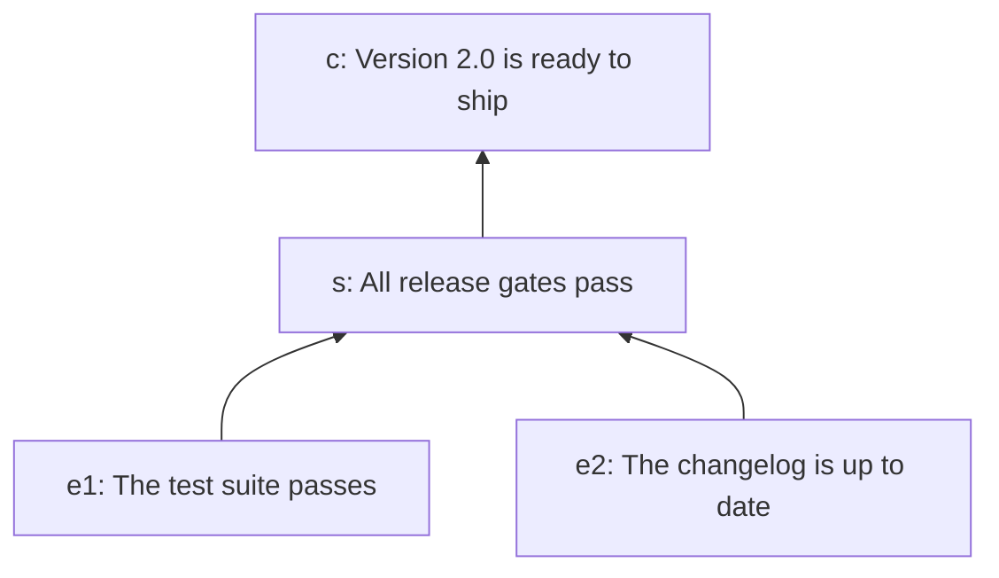

# End to end: the release example

This page follows one example from the argument to its verdict: how a justification
written in jPipe becomes a model the runner reads, how a Python step library is attached
to it, and what the runner does with the two. The test suite runs the same example (and
others) for coverage. This page is meant to be read.

v4 is still being built ([progress](v4-progress.md)). Steps 1 to 6 work
today. Step 7 describes what the next milestones build, and is marked as such. This page
grows with each milestone.

The example is the release argument of the [jPipe tutorials](https://www.jpipe.org/tutorials/),
whose source lives in
[`jpipe-examples/release-example`](https://github.com/jpipe-mcscert/jpipe-examples/tree/main/release-example).
Its files are in [`tests/e2e/scenarios/release_example/`](../tests/e2e/scenarios/release_example/).

## 1. The argument

A team wants to ship version 2.0, and argues that it is ready in
[`release.jd`](../tests/e2e/scenarios/release_example/release.jd):

```
justification release {
  // The claim we want to establish
  conclusion c is "Version 2.0 is ready to ship"

  // The reasoning that connects evidence to the conclusion
  strategy s is "All release gates pass"
  s supports c

  // The supporting evidence (grounds)
  evidence e1 is "The test suite passes"
  e1 supports s

  evidence e2 is "The changelog is up to date"
  e2 supports s
}
```



Read bottom-up: two pieces of evidence support a strategy, which supports the conclusion.
On paper, the argument is only as good as the reader's trust in its evidence. The runner's
job is to back each piece of evidence, and each step of reasoning, with a check that is
actually run.

## 2. Compiling it

The runner does not read `.jd` files. The jPipe compiler does, and exports the model as
JSON ([ADR-0001](adr/0001-consume-compiler-json.md)):

```console
$ jpipe process -i release.jd -m release -f JSON -o justification.json
```

The result, [`justification.json`](../tests/e2e/scenarios/release_example/justification.json),
lists the elements and the relations between them:

```json
{
  "name": "release",
  "type": "justification",
  "elements": [
    { "id": "release:c",  "type": "conclusion", "label": "Version 2.0 is ready to ship" },
    { "id": "release:s",  "type": "strategy",   "label": "All release gates pass" },
    { "id": "release:e1", "type": "evidence",   "label": "The test suite passes" },
    { "id": "release:e2", "type": "evidence",   "label": "The changelog is up to date" }
  ],
  "relations": [
    { "source": "release:s",  "target": "release:c" },
    { "source": "release:e1", "target": "release:s" },
    { "source": "release:e2", "target": "release:s" }
  ]
}
```

(The compiler also writes an `escaped` field per element, which the runner ignores.) Every
id is qualified by the name of the justification: `e1` in the source is `release:e1` here.
These ids are how the step library will refer to the elements.

The compiler can also write the skeleton of a step library (`-f PYTHON`). As of jPipe
2.5.0 that skeleton targets jpipe-runner 3, so for v4 it is written by hand, as below
([#140](https://github.com/jpipe-mcscert/jpipe-runner/issues/140)).

## 3. Reading the model

The runner loads the JSON and checks it before anything else. A file that is not the
compiler's format, an id used twice, or a relation to an element that does not exist is
refused, with every problem reported at once. The release model is valid. In the order the
runner will consider its elements, supporters first:

```
evidence     release:e1   The test suite passes
evidence     release:e2   The changelog is up to date
strategy     release:s    All release gates pass
conclusion   release:c    Version 2.0 is ready to ship
```

## 4. Writing the step library

Each piece of evidence, and the strategy, gets a Python function that checks it. The
library, [`steps.py`](../tests/e2e/scenarios/release_example/steps.py), observes files under
`mock/` instead of a real build: `mock/junit.xml` stands for the test suite's report, and
`mock/CHANGELOG.md` for the release's changelog.

```python
from pathlib import Path
from xml.etree import ElementTree

from jpipe_runner import Fail, Outcome, Pass, evidence, strategy

RELEASE = "2.0"


@evidence("release:e1", observes={"report": "mock/junit.xml"}, produces=["tests_pass"])
def the_test_suite_passes(report: Path) -> Outcome:
    """[evidence] The test suite passes"""
    suite = ElementTree.parse(report).getroot()
    failed = int(suite.get("failures", "0")) + int(suite.get("errors", "0"))
    if failed == 0:
        return Pass(tests_pass=True)
    return Fail(f"{report}: {failed} tests failed")


@evidence("release:e2", observes={"changelog": "mock/CHANGELOG.md"}, produces=["changelog_ok"])
def the_changelog_is_up_to_date(changelog: Path) -> Outcome:
    """[evidence] The changelog is up to date"""
    if RELEASE in changelog.read_text(encoding="utf-8"):
        return Pass(changelog_ok=True)
    return Fail(f"{changelog} does not name release {RELEASE}")


@strategy("release:s", consumes=["tests_pass", "changelog_ok"])
def all_release_gates_pass(tests_pass: bool, changelog_ok: bool) -> Outcome:
    """[strategy] All release gates pass"""
    if tests_pass and changelog_ok:
        return Pass()
    return Fail("a release gate did not pass")
```

What each part says:

- **The decorator is the element's kind.** `@evidence` for evidence, `@strategy` for a
  strategy; there are also `@sub_conclusion` and `@conclusion`. Its first arguments are the
  ids of the element the function implements, here as the compiler exported them.
- **`observes` declares the artifacts an evidence reads.** It maps each of the function's
  parameters to a path, relative to where the runner runs; the runner passes the
  `Path`. An evidence must observe something: one that observes nothing checks nothing in
  the world (`JP018`).
- **`produces` and `consumes` declare the data that flows along the argument.** Each
  piece of evidence produces what it observed; the strategy consumes both. Evidence
  observes the world, so `@evidence` has no `consumes`.
- **A function's parameters are what it observes or consumes.** The runner passes
  `report` and `changelog` to the evidence, and `tests_pass` and `changelog_ok` to the
  strategy, by name. A function whose parameters do not match is refused when the library
  is imported.
- **A function returns an outcome.** `Pass(...)` says the check holds and carries the
  values it produces. `Fail(reason)` says it does not hold, and why. `Skip(reason)`, not
  used here, says the check cannot be judged.
- **The conclusion has no function.** Implementing a conclusion is optional: an unbound
  one takes its status from what supports it. Here, version 2.0 is ready to ship when the
  release gates pass.

Because the functions are plain Python, they can be tried directly, without the runner:

```python
>>> the_test_suite_passes(Path("mock/junit.xml"))
Pass({'tests_pass': True})
>>> all_release_gates_pass(tests_pass=True, changelog_ok=False)
Fail(reason='a release gate did not pass')
```

### Binding the functions to the elements

The runner collects the library's functions and resolves each id to an element of the
model. For the release example, every id is exact:

```
release:c    <- (unbound)
release:s    <- steps.all_release_gates_pass
release:e1   <- steps.the_test_suite_passes
release:e2   <- steps.the_changelog_is_up_to_date
```

Each element is implemented by at most one function, and each function implements exactly
one element. An id may also be shorter than the element's: `@evidence("e1")` binds
`release:e1` too, as long as no other element's id also ends in `e1`. See
[ADR-0007](adr/0007-binding-resolution.md) for the rule.

## 5. Validating the library against the model

Before running anything, the runner checks that the library fits the model:

- every piece of evidence and every strategy has a function;
- each function's kind agrees with its element's;
- each piece of evidence observes an artifact, and produces a value that another step
  consumes;
- every consumed variable is produced by one step, which supports its consumer, so the
  value exists by the time it is needed.

[`rules.md`](rules.md) lists every check. All the problems are reported at once. An error
stops the run before any step executes; a warning is reported, and the run continues.

The release library passes every check: validation reports nothing.

Suppose the strategy misspells a variable, `consumes=["tests_passed", "changelog_ok"]`,
and its parameter with it. The library still imports, since its declaration is consistent
on its face, but validation reports two errors, each with the element it is about and what
to do:

```
JP009 error [release:s]: steps.all_release_gates_pass consumes 'tests_passed', which no step produces
  fix: Produce 'tests_passed' in a step that supports this one.
JP012 error [release:e1]: the evidence steps.the_test_suite_passes produces 'tests_pass', which no step consumes
  fix: Produce what the evidence observed, and consume it in its strategy.
```

The second follows from the first: with the typo, nothing reads what `e1` observed, and
an evidence whose findings nobody uses supports nothing.

## 6. Running the steps

Once the library passes validation, the runner calls the functions supporters first:
`e1` and `e2`, then `s`. Before calling an evidence, it checks that each artifact it
observes is there, and records it: its path, its SHA-256 and its size, as the function is
about to read it ([ADR-0019](adr/0019-evidence-observes-files.md)). Then it passes each
function what it observes and consumes, and records what it returns
([ADR-0021](adr/0021-execution-semantics.md)).

What follows is the text report of the run, as a terminal shows it: each element in the
order it was run, with a symbol for its status (`✔` passed, `✘` failed, `-` skipped), its
kind, its label and its id; under an element that did not pass, why, and for a failed
evidence, the files it observed; then the summary and the verdict. The JSON report of
step 7 records every observed file, with its hash. With both mock files in place,
everything passes:

```
Justification: release
  Version 2.0 is ready to ship

  ✔ Evidence    The test suite passes         # release:e1
  ✔ Evidence    The changelog is up to date   # release:e2
  ✔ Strategy    All release gates pass        # release:s
  ✔ Conclusion  Version 2.0 is ready to ship  # release:c

4 elements (4 passed)
verdict: pass
```

`s` received `tests_pass=True` and `changelog_ok=True`, and passed. The conclusion has no
function: it passes because what supports it passes. Version 2.0 is ready to ship.

**A check that does not hold.** Suppose the test report records two failures,
`failures="2"` in `mock/junit.xml`. The first evidence fails, with the reason its
function gave. Nothing above it can be judged: `s` would need `tests_pass`, which `e1`
never produced. So `s` and the conclusion are skipped, not called, and each names the
element that stopped it. `e2` does not depend on `e1`, and still runs.

```
Justification: release
  Version 2.0 is ready to ship

  ✘ Evidence    The test suite passes         # release:e1
      steps.the_test_suite_passes: mock/junit.xml: 2 tests failed
      observed mock/junit.xml (sha256 f757d068913c…, 187 bytes)
  ✔ Evidence    The changelog is up to date   # release:e2
  - Strategy    All release gates pass        # release:s
      not run: release:e1 did not pass
  - Conclusion  Version 2.0 is ready to ship  # release:c
      not run: release:e1 did not pass

4 elements (1 failed, 2 skipped, 1 passed)
verdict: fail
```

A step that returns `Skip(reason)` stops what it supports in the same way. A
justification in which nothing failed, but something was skipped, is not established:
its verdict is `skip`.

**An artifact that is not there.** If the tests have not run yet, `mock/junit.xml` does
not exist. The runner does not call `the_test_suite_passes` at all: the evidence fails,
and the diagnostic says that the check could not look, rather than that it said no. The
report lists each diagnostic after the elements, with what to do about it.

```
Justification: release
  Version 2.0 is ready to ship

  ✘ Evidence    The test suite passes         # release:e1
      steps.the_test_suite_passes: mock/junit.xml, observed as 'report', does not exist
      observed mock/junit.xml (unreachable)
  ✔ Evidence    The changelog is up to date   # release:e2
  - Strategy    All release gates pass        # release:s
      not run: release:e1 did not pass
  - Conclusion  Version 2.0 is ready to ship  # release:c
      not run: release:e1 did not pass

JP019 error [release:e1]: mock/junit.xml, observed as 'report', does not exist
  fix: Make sure the artifact exists when the runner runs, at this path relative to the directory it runs in, or correct the path in observes={...}.

4 elements (1 failed, 2 skipped, 1 passed)
1 diagnostic (1 error)
verdict: fail
```

A function that raises an exception fails its element in the same way, with `JP022` and
the traceback from its own code, and so does one that returns `True` (`JP017`). Each
broken step fails its element, and the run goes on, so one run reports them all.

## 7. Reading the verdict (planned, M5 and M6)

The `jpipe-runner` command ([#124](https://github.com/jpipe-mcscert/jpipe-runner/issues/124))
will print the text report of step 6, or a JSON report
([#122](https://github.com/jpipe-mcscert/jpipe-runner/issues/122)), and can draw the
argument as a diagram ([#123](https://github.com/jpipe-mcscert/jpipe-runner/issues/123)).
The report will list the artifacts each evidence observed, so that a CI pipeline can
archive them with the verdict ([#145](https://github.com/jpipe-mcscert/jpipe-runner/issues/145)).
Its exit code tells a CI pipeline whether the justification holds: a skipped
justification exits 0, unless the run is strict.

## When something is wrong

Mistakes are reported at the earliest stage that can see them, with a code that names the
problem and, where there is something specific to do, a fix.

**A typo in an id** (`"release:e3"` instead of `"release:e1"`) binds nothing. v3 ignored it
silently, so the check never ran; v4 says so:

```
JP015 error: steps.the_test_suite_passes: 'release:e3' designates no element of 'release', so the function would never run
  fix: Use the id of an element of the model, as the compiler exports it.
```

**A parameter that is not consumed** stops the library from loading, at the line that
declares it:

```
TypeError: @strategy all_release_gates_pass: its parameters ['changelog_ok'] are not consumed, so nothing would pass them. A step's parameters are the variables it consumes, as declared by consumes=[...].
```

**A v3 habit: returning a boolean.** A function that returns `True` is told what to return
instead:

```
JP017 error [release:e1]: the step returned True, which is not an outcome
  fix: Return Pass() instead of True.
```

**A v3 library** stops at its first import, `from jpipe_runner.framework…`, with a message
that names the v4 replacements.

## Going further: a refined argument

Arguments grow. A later draft of the release argument, `draft`, adds a sub-argument for
the documentation, but still treats "the test suite passes" as a black box. A second justification, `tested`, argues the claim "the code is tested" in
full, and `refine` grafts it onto the draft in place of that evidence
([`refine.jd`](../tests/e2e/scenarios/composed/refine.jd), the
[refine tutorial](https://www.jpipe.org/tutorials/refine/)):

```
justification readiness is refine(draft, tested) {
  hook: "tests"
}
```

The step libraries were written earlier, against each model on its own:
[`draft_steps.py`](../tests/e2e/scenarios/composed/draft_steps.py) binds `draft:tests`,
`draft:changelog` and so on, and
[`tested_steps.py`](../tests/e2e/scenarios/composed/tested_steps.py) binds `tested:suite`,
`tested:coverage` and `tested:testing`. They need no change to bind to the refined model:

```
conclusion      readiness:draft:ready        <- (unbound)
strategy        readiness:draft:gates        <- all_release_gates_pass via 'draft:gates'
sub-conclusion  readiness:hook               <- the_test_suite_passes via 'draft:tests' (declared evidence)
sub-conclusion  readiness:draft:documented   <- (unbound)
strategy        readiness:draft:docs         <- the_changelog_and_api_docs_are_current via 'draft:docs'
evidence        readiness:draft:changelog    <- the_changelog_is_up_to_date via 'draft:changelog'
strategy        readiness:tested:testing     <- the_test_suite_passes_with_high_coverage via 'tested:testing'
evidence        readiness:tested:suite       <- the_test_suite_passes via 'tested:suite'
evidence        readiness:tested:coverage    <- coverage_is_above_80 via 'tested:coverage'
```

Two things happened:

- **Composition prefixed the ids.** `draft:changelog` became `readiness:draft:changelog`.
  The old id is a tail of the new one, so it still binds.
- **The hook changed kind but kept its id.** `refine` merged the draft's evidence `tests`
  and the conclusion of `tested` into one sub-conclusion, `readiness:hook`, which keeps
  both old ids as aliases. The draft's check for "the test suite passes" therefore still
  binds, to a node that is now argued in full below it. It runs as an independent
  cross-check of that sub-argument.

Validation points the change of kind out, as a warning rather than an error
([ADR-0013](adr/0013-kind-divergence-under-composition.md)). It is the only thing it
reports on the refined model, so the run goes on:

```
JP008 warning [readiness:hook]: draft_steps.the_test_suite_passes is declared as evidence, and is bound to a sub-conclusion: it runs as a cross-check of the argument below it
  fix: Nothing to do for a cross-check. If the library serves only the composed model, declare the step with @sub_conclusion.
```

The run calls `the_test_suite_passes` of the draft, for `readiness:hook`, after the
argument of `tested` below it, and only because that argument passed:

```
Justification: readiness
  Version 2.0 is ready to ship

  ✔ Evidence        The changelog is up to date               # readiness:draft:changelog
  ✔ Strategy        The changelog and API docs are current    # readiness:draft:docs
  ✔ Sub-conclusion  The documentation is updated              # readiness:draft:documented
  ✔ Evidence        The test suite passes                     # readiness:tested:suite
  ✔ Evidence        Coverage is above 80%                     # readiness:tested:coverage
  ✔ Strategy        The test suite passes with high coverage  # readiness:tested:testing
  ✔ Sub-conclusion  The code is tested                        # readiness:hook
  ✔ Strategy        All release gates pass                    # readiness:draft:gates
  ✔ Conclusion      Version 2.0 is ready to ship              # readiness:draft:ready

JP008 warning [readiness:hook]: draft_steps.the_test_suite_passes is declared as evidence, and is bound to a sub-conclusion: it runs as a cross-check of the argument below it
  fix: Nothing to do for a cross-check. If the library serves only the composed model, declare the step with @sub_conclusion.

9 elements (9 passed)
1 diagnostic (1 warning)
verdict: pass
```

Libraries written against separate models need a little care to run together: variable
and file names are shared by the whole run, `assemble` adds a strategy that needs a step
of its own, and a cross-check must stay bound. See
[Libraries written for separate models](authoring.md#libraries-written-for-separate-models).
